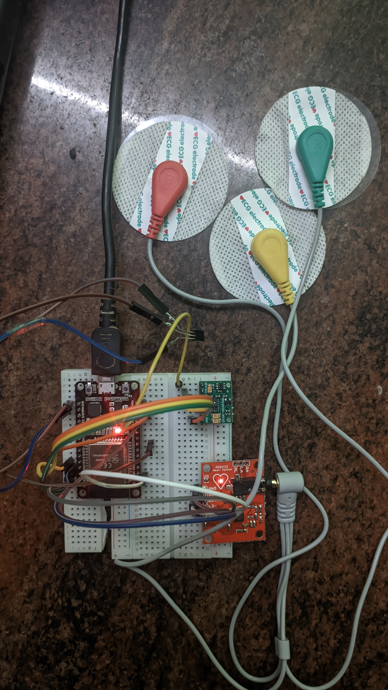

# Health-Monitoring-System
An IOT based mobile application to monitor the vitals such as ECG, Body Temperature, Blood Pressure using an ESP32 DevKit and React Native.

UI Design: [Figma](https://www.figma.com/file/2k3nB1VWpkEwkA4gmM3pjB/App-Design-(Padanam)?type=design&node-id=0%3A1&t=zoONViKr7hucSDKS-1) 

## Sensors Used

- LM35 temperature Sensor
- MAX 30102 Pluseoximeter
- AD 8232 ECG Sensor

## Harware Setup

- ### DOIT ESP32 Devkit V1
- ### MAX30102 

|**Sensor** |**ESP32**  |
|---|---|
|VIN |3V |
|SCL| 22 |
|SDA| 21 |
|GND| GND|

- ### AD 8232

|**Sensor** |**ESP32**  |
|---|---|
|VIN |3V |
|OUTPUT| AP|
|L0+| 34 |
|L0-| 35 |
|GND| GND|

- ### LM 35

|**Sensor** |**ESP32**  |
|---|---|
|VIN |3V |
|OUT | 25|
|GND| GND|

    

